# AlignView 3D 🦷✨

> **Next-Generation WebGL 3D Dental STL Previewer & Continuous Multi-Stage Aligner Simulator**
>
> *A proprietary product of **MidCell Studios**.*

[](https://nextjs.org/)
[](https://www.typescriptlang.org/)
[](https://threejs.org/)
[](https://docs.pmnd.rs/react-three-fiber/)
[](https://tailwindcss.com/)
[](LICENSE)

**AlignView 3D** is a medical-grade web application engineered for orthodontists, dental clinics, CAD labs, and patients to inspect 3D dental scan models (`.stl`), simulate multi-stage clear aligner treatment sequences ($1 \dots N$), analyze occlusion, calculate sub-millimeter Euclidean caliper distances, and cross-section anatomical arches in real-time WebGL.

All source code and 3D dental algorithms are strictly proprietary. Unauthorized duplication, cloning, or commercial redistribution is strictly prohibited.

---

## 🌟 Key Features

### 1. 🦷 High-Fidelity 3D Dental Anatomy & Occlusion
- **Dual-Tissue Material Shading**: Realistic pearlescent ivory enamel teeth with natural specular gloss and anatomical coral-pink gingiva (gum tissue).
- **Full Dental Occlusion**: Upper and lower horseshoe arches modeled in Class I occlusion with natural overbite and overjet.
- **Dynamic Arch Views**: Instant toggling between **Both Arches**, **Upper Only**, **Lower Only**, and **Split View** (dual side-by-side comparative inspection).

### 2. 🎬 Continuous Multi-Stage Aligner Treatment Staging
- **Dynamic Biomechanical Trajectory**: Continuous, physically accurate rotation, root torque, tipping corrections, and parabolic arch expansion across unlimited treatment stages ($1 \dots N$).
- **Interactive Scrubber**: Discrete step tick marks, active gradient progress fill, and direct stage scrubbing.
- **Playback Controls**: Step Back (`|◀`), Play / Pause (`▶` / `⏸`), Step Forward (`▶|`), variable playback speeds (`0.5x` to `2.5x`), and looping mode.

### 3. 📐 Precision 3D Caliper & Cross-Section Slicing
- **Point-to-Point Measurement**: Click two anatomical landmarks on teeth or gums to calculate live millimeter Euclidean distance.
- **Dynamic Cross-Section Tool**: Slice through the dental model along the **X**, **Y**, or **Z** axis with an interactive slider (`-30mm` to `+30mm`) for internal root and crown inspection.

### 4. 🎨 4 Multi-Shader Diagnostic Modes
- **Shaded (PBR)**: Photorealistic studio dental material with subtle subsurface reflections and contact shadows.
- **Wireframe**: High-density geometric mesh visualization for polygon and triangle inspection.
- **Solid**: Matte studio clay shader for surface curvature and topological defect inspection.
- **X-Ray**: Semi-transparent holographic glass shader for visualizing overlapping roots and internal structures.

### 5. 🧭 3D Orientation Gizmo & Camera Controls
- **Interactive View Cube**: Quick-snap directional buttons for `U` (Up/Top), `D` (Down/Bottom), `L` (Left), `R` (Right), and `F` (Front).
- **Smooth Camera Tweening**: Smooth interpolation between angles and **Reset View** framing.
- **Orbit Navigation**: 360° mouse drag orbit, right-click pan, and pinch/wheel zoom.

### 6. 📁 Dual Arch File Management & Custom STL Loader
- **Upper & Lower File Browsers**: 16 Upper Arch and 17 Lower Arch sequence files with rich 3D thumbnails, dates, and file sizes.
- **Live Search**: Fast filtering across model files.
- **Custom STL Drag-and-Drop**: Load custom user `.stl` files directly into the 3D canvas with automatic bounding box and vertex diagnostics.
- **High-Res Snapshot**: One-click PNG capture of the current 3D viewport with studio lighting preserved.

### 7. 🔐 Clinician Portal & Fast-Track Demo Mode
- **Clinician Portal**: Dedicated login portal with encrypted local session handling.
- **Fast-Track Demo Access**: One-click demo clinician login for instant evaluations.
- **100% Client-Side Privacy**: Zero cloud uploads. All scan geometry and telemetry remain safely sandboxed in browser RAM (HIPAA & GDPR safe by design).

### 8. 🔤 Modern Design & Typography System
- **Plus Jakarta Sans**: Primary body text and UI controls.
- **Outfit**: High-impact editorial display typography for headlines and metrics.
- **JetBrains Mono**: Precision monospaced numbers for caliper measurements, FPS counters, and step indicators.
- **Micro-Animations**: Native `IntersectionObserver` scroll reveals, dynamic typewriter hero headlines, and responsive slide-over drawers.

---

## 🏗️ Architecture & Tech Stack

```mermaid
graph TD
    %% Global Application Architecture
    subgraph UI_Layer ["🖥️ Presentation & Routing Layer (Next.js 16 App Router)"]
        LandingPage["src/app/page.tsx (Landing Page)"]
        StudioPage["src/app/studio/page.tsx (3D STL Dental Studio)"]
        LoginPage["src/app/login/page.tsx (Clinician Sign-In Portal)"]
        Header["Header (Brand, Logout, Reset, Screenshot, Fullscreen)"]
        LeftSidebar["Upper Arch Sidebar (Search, File List, 3D Thumbs)"]
        RightSidebar["Lower Arch Sidebar (Search, File List, 3D Thumbs)"]
        Timeline["TimelinePlayback (Multi-Stage Scrubber, Speed, Loop)"]
        UploadModal["UploadModal (Drag-and-Drop STL Parser)"]
    end

    subgraph State_Layer ["⚡ Reactive State Store (Zustand)"]
        Store[("useViewerStore")]
        Store --- S1["Model Files & Active Selection (Upper / Lower)"]
        Store --- S2["View Modes (Both / Upper / Lower / Split)"]
        Store --- S3["Render Shaders (Shaded / Wire / Solid / X-Ray)"]
        Store --- S4["Active Tools (Move / Rotate / Zoom / Pan / Measure / Section)"]
        Store --- S5["Timeline Playback (Stage 1..N, Speed, Loop)"]
        Store --- S6["Camera Controls (Snap Targets & Tweens)"]
        Store --- S7["Telemetry Data (Vertices, Triangles, Dimensions)"]
    end

    subgraph Viewport_Layer ["🌐 3D Viewport & Overlays (React Three Fiber)"]
        Canvas["DentalCanvas (R3F Canvas, Studio Lights, Contact Shadows)"]
        ViewCube["ViewCubeGizmo (U / D / L / R / F Snap Controls)"]
        ToolPalette["FloatingToolPalette (Tool Switcher)"]
        StatsCard["ModelStatsCard (Live Geometry Telemetry)"]
        RenderPill["RenderModePill (Shader Selector)"]
        ViewPill["ViewModePill (Arch View Selector)"]
        MeasureOverlay["MeasurementOverlay (Real-time Caliper Distance)"]
        SectionSlider["SectionSlider (Dynamic X/Y/Z Slice Offset)"]
    end

    subgraph Core_3D_Engine ["⚙️ 3D Geometry & Simulation Pipeline (Three.js)"]
        ModelRenderer["DentalArchModel (Dual-Arch Mesh Renderer)"]
        GeomGen["DentalGeometryGenerator (Tooth Morphology & Aligner Morpher)"]
        STLLoader["STLLoader (Custom Binary/ASCII Mesh Parser)"]
        Shaders["Dental Shaders (Pearlescent Enamel PBR & Coral Gingiva)"]
        ClipEngine["Local Clipping Plane Engine (Cross-Section Inspection)"]
        CaliperRaycast["Point-to-Point Raycaster (3D Distance Measurement)"]
    end

    %% Component Data Flows
    LandingPage & StudioPage & LoginPage --> Header
    StudioPage --> LeftSidebar & RightSidebar & Timeline & UploadModal & Canvas
    Canvas --> ViewCube & ToolPalette & StatsCard & RenderPill & ViewPill & MeasureOverlay & SectionSlider & ModelRenderer
    ModelRenderer --> GeomGen & STLLoader & Shaders & ClipEngine & CaliperRaycast

    %% Reactive State Bindings
    LeftSidebar & RightSidebar & Timeline & Header & ViewCube & ToolPalette & SectionSlider <--> Store
    Store <--> ModelRenderer
```



```
AlignView 3D Tech Stack
├── Framework: Next.js 16 (App Router + Turbopack)
├── Language: TypeScript (Strict mode)
├── 3D Engine: Three.js r167 + @react-three/fiber + @react-three/drei
├── State Management: Zustand 4.5
├── Styling: Tailwind CSS 3.4 + PostCSS + Glassmorphism UI
├── Typography: Plus Jakarta Sans, Outfit, JetBrains Mono (next/font/google)
├── Icons: Lucide React
└── Parsers: STLLoader (three-stdlib)
```

---

## 📂 Project Structure

```
AlignView 3D/
├── public/                          # Brand logos, favicons, manifests & STL models
│   ├── favicon.png                  # Site favicon and app icon
│   ├── main-logo.png                # Full brand lockup for light surfaces
│   ├── main-logo-light.png          # Full brand lockup for dark surfaces
│   ├── logo.png                     # Standalone brand mark
│   └── models/                      # Upper and lower dental arch STL assets
├── src/
│   ├── app/
│   │   ├── globals.css              # Glassmorphism, scrollbars, text-rendering
│   │   ├── layout.tsx               # Root layout, Google Fonts & SEO metadata
│   │   ├── page.tsx                 # Main landing page
│   │   ├── studio/                  # 3D Dental CAD Studio
│   │   │   └── page.tsx
│   │   ├── login/                   # Clinician Sign-In portal
│   │   │   └── page.tsx
│   │   ├── terms/                   # Terms of Service & Licensing
│   │   │   └── page.tsx
│   │   ├── privacy/                 # Privacy & HIPAA statements
│   │   │   └── page.tsx
│   │   ├── security/                # Security Sandbox specifications
│   │   │   └── page.tsx
│   │   ├── manifest.ts              # Progressive Web App manifest
│   │   ├── robots.ts                # Search crawler rules
│   │   └── sitemap.ts               # Dynamic XML sitemap
│   ├── components/
│   │   ├── header/
│   │   │   └── Header.tsx           # Studio header, Reset, Screenshot, Logout
│   │   ├── sidebar/
│   │   │   └── ArchSidebar.tsx      # Upper/Lower arch sequence browser & thumbnails
│   │   ├── viewport/
│   │   │   ├── DentalCanvas.tsx     # R3F Canvas, lighting, shadows, camera
│   │   │   ├── DentalArchModel.tsx  # Dual arch mesh, shaders, clipping planes
│   │   │   ├── DentalGeometryGenerator.ts # Tooth morphology & aligner trajectory
│   │   │   ├── ViewCubeGizmo.tsx    # U/D/L/R/F 3D orientation widget
│   │   │   ├── FloatingToolPalette.tsx # Move, Rotate, Zoom, Pan, Measure, Section
│   │   │   ├── ViewModePill.tsx     # Both, Upper, Lower, Split View
│   │   │   ├── RenderModePill.tsx   # Shaded, Wireframe, Solid, X-Ray
│   │   │   ├── ModelStatsCard.tsx   # Vertices, Triangles, Dimensions telemetry
│   │   │   ├── MeasurementOverlay.tsx # Live millimeter caliper banner
│   │   │   └── SectionSlider.tsx    # Dynamic X/Y/Z clipping plane slider
│   │   ├── timeline/
│   │   │   └── TimelinePlayback.tsx # Multi-stage sequence scrubber & player
│   │   ├── landing/
│   │   │   ├── LandingNavbar.tsx    # Floating island navbar
│   │   │   ├── HeroSection.tsx      # Dynamic typing typewriter hero headline
│   │   │   ├── BentoGridSection.tsx # Interactive feature showcase
│   │   │   ├── MetricsSection.tsx   # GPU performance & telemetry cards
│   │   │   ├── FaqSection.tsx       # Searchable accordion knowledge base
│   │   │   ├── CtaSection.tsx       # Instant launch call to action
│   │   │   └── LandingFooter.tsx    # Dark footer with brand navigation
│   │   ├── ui/
│   │   │   ├── AppPreloader.tsx     # Full-screen orbital brand loading screen
│   │   │   ├── FloatingBackToTop.tsx # Floating tooth back-to-top button
│   │   │   └── ScrollReveal.tsx     # Native IntersectionObserver animations
│   │   └── modals/
│   │       └── UploadModal.tsx      # STL file drag-and-drop parser
│   ├── store/
│   │   └── useViewerStore.ts        # Central Zustand application state
│   └── types/
│       └── dental.ts                # TypeScript interfaces & types
├── .npmrc                           # Vercel legacy peer dependencies config
├── package.json
├── tsconfig.json
├── tailwind.config.ts
├── LICENSE                          # Proprietary source code license
└── README.md
```

---

## 🚀 Getting Started

### Prerequisites
- **Node.js**: `v18.17.0` or later
- **npm**: `v9.0.0` or later

### Installation & Local Development

1. **Install dependencies**:
   ```bash
   npm install
   ```

2. **Start the development server**:
   ```bash
   npm run dev
   ```

3. **Open in browser**:
   Navigate to [http://localhost:3000](http://localhost:3000).

### Production Build

```bash
npm run build
npm run start
```

---

## 🖱️ Navigation & Controls

| Action | Desktop (Mouse) | Mobile / Tablet (Touch) | Description |
| :--- | :--- | :--- | :--- |
| **Orbit / Rotate** | Left Click + Drag | Single-Finger Drag | Orbit 360° around the center of the dental arch |
| **Pan Viewport** | Right Click + Drag | Two-Finger Drag | Pan viewport horizontally and vertically |
| **Zoom** | Mouse Wheel | Pinch In / Out | Smoothly zoom in/out with bounded limits (20mm - 180mm) |
| **Snap Camera** | Click `U` / `D` / `L` / `R` / `F` | Tap `U` / `D` / `L` / `R` / `F` | Smoothly lerp camera to Top, Bottom, Left, Right, Front |
| **Measure Caliper** | Select `Measure` & Click 2 Points | Select `Measure` & Tap 2 Points | Places 3D markers and renders live distance in mm |
| **Cross-Section** | Select `Section` & Drag Slider | Select `Section` & Drag Slider | Dynamically slices model along chosen X/Y/Z axis |
| **Stage Scrubbing** | Drag Timeline Progress Bar | Drag Timeline Progress Bar | Step through treatment trajectory stages ($1 \dots N$) |

---

## 📄 License & Intellectual Property

AlignView 3D is a proprietary product of **MidCell Studios**. All rights reserved.

Unauthorized copying, cloning, reverse engineering, code redistribution, or creating unauthorized commercial forks is strictly prohibited under our [Proprietary License](LICENSE) and [Terms of Service](https://alignview-3d.vercel.app/terms).
