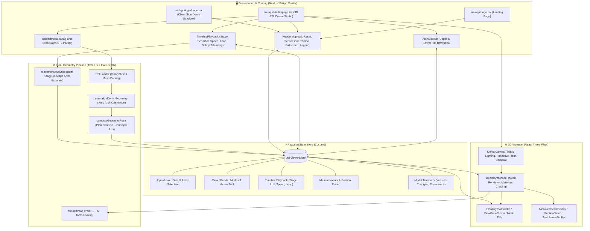

<div align="center">

  

  <br />
  <br />

  <a href="https://alignview-3d.vercel.app">
    
  </a>

  <p align="center">
    <b>A medical-grade WebGL 2.0 dental STL viewer for uploaded, real multi-stage orthodontic aligner treatment sequences.</b>
  </p>

  <p align="center">
    <a href="https://alignview-3d.vercel.app">
      
    </a>
    <a href="https://alignview-3d.vercel.app/login">
      
    </a>
  </p>

  <p align="center">
    
    
    
    
    
    
    
    
  </p>

  <p align="center">
    <sub>A proprietary software product of <b>MidCell Studios</b>. All Rights Reserved.</sub>
  </p>

</div>

---

> [!IMPORTANT]
> **AlignView 3D** is engineered for dental clinicians, orthodontists, CAD labs, and medical software developers. It operates **100% client-side** in your web browser — you upload your own `.stl` files, they're parsed entirely in browser memory, and nothing is transmitted to a server. There is no backend, no database, and no real user-account system: the "Clinician Portal" is an explicit sandbox/demo shell that matches this zero-server-storage design.

---

## 🦷 What This App Actually Does

AlignView 3D is an **upload-driven** 3D viewer for a patient's multi-stage clear-aligner treatment sequence, exported as a batch of `.stl` files by dental CAD/lab software (e.g. `PatientName Upper jaw - 07 - Model.stl`). There is no procedural tooth generator and no bundled sample case — every model on screen comes from files you drag into the **Universal STL Batch Upload** modal.

1. **Upload** — drop in all of a case's `.stl` files at once (upper + lower, any number of stages, plus optional "Template" files).
2. **Auto-segregate** — `parseSTLFilename` reads each filename to detect arch (upper/lower), stage number, template flag, and a consensus patient name across the batch.
3. **Normalize & render** — each mesh is parsed with `STLLoader`, auto-oriented into a consistent dental coordinate frame (`normalizeDentalGeometry`), and rendered with one of 4 PBR-based material modes.
4. **Explore** — scrub through stages on the timeline, switch view modes (Both / Upper / Lower / Split), measure point-to-point distances, slice with a clipping plane, and identify teeth by FDI notation on hover.
5. **Real stage telemetry** — a whole-arch movement estimate (translation + rotation) is computed directly from each stage's raw geometry centroid/principal axis vs. the previous stage — a genuine measurement derived from your uploaded data, not a simulated placeholder. It's explicitly labeled as a whole-arch approximation, not a per-tooth clinical measurement (that would require tooth segmentation, which this app does not perform).

---

## 🌟 Feature Showcase

<table width="100%">
  <tr>
    <td width="50%" valign="top">
      <h3>🦷 1. Dual-Arch Anatomy & Occlusion</h3>
      <ul>
        <li><b>PBR Enamel Shading</b>: Physically-based material with clearcoat + studio reflections.</li>
        <li><b>Dynamic Arch Views</b>: Toggle between <b>Both Arches</b>, <b>Upper Only</b>, <b>Lower Only</b>, and side-by-side <b>Split View</b>.</li>
        <li><b>Auto-Oriented Geometry</b>: Heuristic normalization aligns uploaded scans into a consistent occlusal/anatomical frame regardless of the source CAD export orientation.</li>
      </ul>
    </td>
    <td width="50%" valign="top">
      <h3>🎬 2. Multi-Stage Sequence Playback</h3>
      <ul>
        <li><b>Real Uploaded Stages</b>: Scrub through every stage file you uploaded (<code>1 … N</code>), sorted by detected stage number.</li>
        <li><b>Playback Controls</b>: Step Back / Play / Pause / Step Forward, variable speed (<code>0.5x</code>–<code>2.5x</code>), and loop mode.</li>
        <li><b>Geometry-Derived Movement Estimate</b>: Whole-arch centroid shift (mm) and principal-axis rotation (°) between consecutive stage STLs, checked against standard 0.25&nbsp;mm / 2.0° clinical stage budgets.</li>
      </ul>
    </td>
  </tr>
  <tr>
    <td width="50%" valign="top">
      <h3>📐 3. Caliper & Cross-Section Slicing</h3>
      <ul>
        <li><b>Point-to-Point Caliper</b>: Click any 2 points on a mesh to get live Euclidean distance in millimeters.</li>
        <li><b>3-Axis Clipping Plane</b>: Slice through the arch along X, Y, or Z for internal crown/root inspection.</li>
      </ul>
    </td>
    <td width="50%" valign="top">
      <h3>🎨 4. 4 Diagnostic Material Shaders</h3>
      <ul>
        <li><b>Shaded (PBR)</b>: Studio dental material with clearcoat + contact shadows.</li>
        <li><b>Wireframe</b>: Triangle/polygon mesh density inspection.</li>
        <li><b>Solid Clay</b>: Matte studio clay for curvature/defect analysis.</li>
        <li><b>X-Ray Glass</b>: Semi-transparent shader for internal inspection.</li>
      </ul>
    </td>
  </tr>
</table>

---

## 🧭 Interactive Navigation & Controls

| Action | Desktop (Mouse) | Mobile / Tablet (Touch Gestures) | Description |
| :--- | :--- | :--- | :--- |
| **Orbit / Rotate** | `Left Click + Drag` | `Single-Finger Drag` | 360° smooth camera orbit around center of arch |
| **Pan Viewport** | `Right Click + Drag` | `Two-Finger Drag` | Pan camera horizontally and vertically |
| **Zoom Viewport** | `Mouse Wheel Scroll` | `Pinch In / Out` | Bounded zoom range with smooth damping |
| **Snap Camera** | Click `U` / `D` / `L` / `R` / `F` on the ViewCube | Tap `U` / `D` / `L` / `R` / `F` | Smoothly tween camera to Top, Bottom, Left, Right, Front |
| **Measure Caliper** | Select `Measure` & Click 2 Points | Select `Measure` & Tap 2 Points | Places 3D markers with live millimeter distance |
| **Cross-Section** | Select `Section` & Drag Slider | Select `Section` & Drag Slider | Dynamically slices model along chosen X/Y/Z axis |
| **Stage Scrubbing** | Drag Timeline Slider | Drag Timeline Slider | Step through uploaded treatment stages (`1 … N`) |

---

## 🏗️ Architecture & Data Flow



---

## 📂 Project Directory Structure

```
AlignView 3D/
├── public/                          # Brand logos, favicons & manifests (no bundled STL models)
├── scripts/
│   ├── generate-png.js              # Brand asset generation helper
│   └── e2e-real-data-check.ts       # Verifies the parse → normalize → pose → movement pipeline against a real STL sequence
├── src/
│   ├── app/
│   │   ├── page.tsx                 # Landing page
│   │   ├── studio/page.tsx          # 3D Dental CAD Studio
│   │   ├── login/page.tsx           # Client-side demo sign-in sandbox
│   │   ├── terms/, privacy/, security/  # Static legal/compliance pages
│   │   ├── manifest.ts, robots.ts, sitemap.ts
│   │   └── layout.tsx
│   ├── components/
│   │   ├── header/Header.tsx        # Upload, Reset View, Screenshot, Theme, Fullscreen, Logout
│   │   ├── sidebar/ArchSidebar.tsx  # Upper/Lower file browser, search, delete, thumbnails
│   │   ├── viewport/
│   │   │   ├── DentalCanvas.tsx     # R3F Canvas, studio lighting, reflective floor, camera
│   │   │   ├── DentalArchModel.tsx  # Renders the active upper/lower meshes & materials
│   │   │   ├── ViewCubeGizmo.tsx, FloatingToolPalette.tsx
│   │   │   ├── ViewModePill.tsx, RenderModePill.tsx, ModelColorPicker.tsx
│   │   │   ├── ModelStatsCard.tsx, MeasurementOverlay.tsx, SectionSlider.tsx
│   │   │   └── ToothHoverTooltip.tsx
│   │   ├── timeline/TimelinePlayback.tsx  # Stage scrubber, playback, safety telemetry popover
│   │   ├── landing/                 # Marketing landing page sections
│   │   ├── ui/                      # Preloader, back-to-top, scroll reveal
│   │   └── modals/UploadModal.tsx   # Batch STL drag-and-drop upload & parsing UI
│   ├── store/useViewerStore.ts      # Central Zustand application state store
│   ├── utils/
│   │   ├── stlParser.ts             # Filename parsing, geometry normalization, pose (PCA) extraction
│   │   ├── movementAnalytics.ts     # Real geometry-derived stage-to-stage movement estimate
│   │   ├── fdiToothMap.ts           # FDI tooth lookup by 3D hit point
│   │   └── slerpInterpolation.ts    # SE(3) pose interpolation helper (quaternion slerp)
│   └── types/dental.ts              # Shared TypeScript interfaces
├── .npmrc
├── package.json
├── tsconfig.json
├── tailwind.config.ts
├── LICENSE
└── README.md
```

---

## 🚀 Getting Started

### Prerequisites
- **Node.js**: `v18.17.0` or later
- **npm**: `v9.0.0` or later

### Installation & Local Development

1. **Install dependencies**:
   ```bash
   npm install
   ```

2. **Start development server**:
   ```bash
   npm run dev
   ```

3. **Open browser**:
   Navigate to [http://localhost:3000](http://localhost:3000), sign in via the demo sandbox, and upload your own `.stl` sequence from the Studio's upload prompt.

### Production Build

```bash
npm run build
npm run start
```

---

## 🔒 Security, HIPAA & GDPR Compliance

- **Zero Cloud Geometry Storage**: All `.stl` files are parsed locally in browser RAM. No patient geometry or scan data is transmitted to remote servers — there is no upload endpoint.
- **Client-Side Sandbox**: Sessions operate entirely in an isolated browser context with zero persistence of sensitive health data; reloading the page clears all loaded models.
- **No Real Accounts**: The "Clinician Portal" is an explicit sandbox demo — it does not authenticate against any backend, by design.

---

## 📄 License & Intellectual Property

<div align="center">
  <p><b>PROPRIETARY SOFTWARE LICENSE</b></p>
  <p>© 2025–2026 <b>MidCell Studios</b>. All Rights Reserved.</p>
</div>

AlignView 3D, including its source code, geometry normalization logic, shader pipelines, user interfaces, branding, and assets, is the exclusive intellectual property of **MidCell Studios**.

Unauthorized copying, cloning, modifying, reverse engineering, publishing, sublicensing, or distributing this software in whole or in part is strictly prohibited under our [Proprietary License](LICENSE) and [Terms of Service](https://alignview-3d.vercel.app/terms).
