<div align="center">

  

  <br />
  <br />

  <a href="https://alignview-3d.vercel.app">
    
  </a>

  <p align="center">
    <b>A medical-grade WebGL 2.0 dental STL viewer for uploaded, real multi-stage orthodontic aligner treatment sequences.</b>
  </p>

  <p align="center">
    <a href="https://alignview-3d.vercel.app">
      
    </a>
    <a href="https://alignview-3d.vercel.app/login">
      
    </a>
  </p>

  <p align="center">
    
    
    
    
    
    
    
    
  </p>

  <p align="center">
    <sub>A proprietary software product of <b>MidCell Studios</b>. All Rights Reserved.</sub>
  </p>

</div>

---

> [!IMPORTANT]
> **AlignView 3D** is engineered for dental clinicians, orthodontists, CAD labs, and medical software developers. It operates **100% client-side** in your web browser — you upload your own `.stl` files, they're parsed entirely in browser memory, and nothing is transmitted to a server. There is no backend, no database, and no real user-account system: the "Clinician Portal" is an explicit sandbox/demo shell that matches this zero-server-storage design.

---

## 🦷 What This App Actually Does

AlignView 3D is an **upload-driven** 3D viewer for a patient's multi-stage clear-aligner treatment sequence, exported as a batch of `.stl` files by dental CAD/lab software (e.g. `PatientName Upper jaw - 07 - Model.stl`). There is no procedural tooth generator and no bundled sample case — every model on screen comes from files you drag into the **Universal STL Batch Upload** modal.

1. **Upload** — drop in all of a case's `.stl` files at once (upper + lower, any number of stages, plus optional "Template" files).
2. **Auto-segregate** — `parseSTLFilename` reads each filename to detect arch (upper/lower), stage number, template flag, and a consensus patient name across the batch.
3. **Place into a shared arch frame** — one orientation transform is derived per arch from its earliest non-template stage and applied to *every* stage of that arch. This is the difference between showing real tooth movement and showing nothing: re-deriving the transform per stage re-centres each mesh and cancels the movement out. A stage whose placed bounding-box centre lands more than 5 mm from the reference is treated as a different exported frame, given its own placement, and flagged as not comparable.
4. **Split crown from gingiva** — the gingival margin is estimated per angular bin from the shape of the mesh, triangles are reordered into a crown group and a gum group, and the two get separate materials and separate colour pickers. There is no per-tooth segmentation and none is needed for this: what separates enamel from soft tissue is one closed curve around the arch.
5. **Register the bite** — the lower arch is fitted into cusp-to-fossa contact with the upper. This is a surface fit, not a recorded bite, so it is labelled as an estimate and shipped with manual vertical, sagittal, and pitch correction.
6. **Explore** — scrub through stages on the timeline, switch view modes (Both / Upper / Lower / Split), switch render modes including a movement heat map, measure point-to-point distances, slice with a clipping plane, adjust the bite, and identify teeth by FDI notation on hover.
7. **Measure movement honestly** — per-stage crown movement is the distance from each of 20,000 sampled crown points to the nearest *surface* on the comparison stage, resolved against a bounding volume hierarchy. Nearest-surface rather than nearest-vertex, because remeshed stages have no vertex correspondence. The verdict reads the 95th percentile rather than the single worst spot, and it is only shown against a 0.25 mm per-stage budget when the two stages compared are genuinely consecutive and share an arch frame.

---

## 🎯 What Is Measured and What Is Estimated

A preview you send to a patient or a referring dentist is only worth sending if it is clear
which numbers on it are measurements. This is the whole list.

| Quantity | Status | How it is derived | Where it can be wrong |
| :--- | :--- | :--- | :--- |
| **Crown movement per stage** | Measured | Distance from each of 20,000 sampled crown points to the nearest triangle on the comparison stage, via a bounding volume hierarchy | Only meaningful between stages that share an arch frame. The app suppresses the budget verdict when they do not |
| **Arch dimensions, vertex and triangle counts** | Measured | Straight from the uploaded mesh | Nothing, beyond what the exporter wrote |
| **Stage order and patient name** | Detected | Parsed from filenames, with a consensus vote across the batch | An exporter with an unusual naming scheme. Files with no detectable stage fall back to upload order |
| **Arch placement** | Derived | One transform per arch from its earliest non-template stage | An exporter that re-origins each file. Detected past 5 mm of bbox-centre drift and flagged |
| **Gingival margin, crown/gum split** | Estimated | Per angular bin, from where the radial depth profile bends outward | An arch trimmed unusually high or low. Judge it on the rendered gum line, not on triangle counts |
| **Bite registration** | Estimated | Cusp-to-fossa surface fit between the two arches | Shallow or unusual occlusions. Labelled as an estimate in the UI and manually correctable |
| **FDI tooth identification on hover** | Estimated | Spatial lookup against a canonical arch layout | Crowded or rotated dentition, and any arch missing teeth |

There is **no** per-tooth segmentation, **no** root modelling, and **no** treatment
simulation. The app shows the stages your CAD software produced; it does not predict them.

### Verifying against a real case

`scripts/e2e-real-data-check.ts` runs the exact import pipeline the app runs over a real
STL sequence placed in `/STL`, then checks placement drift, the crown/gum area split, the
gingival margin depth by region, per-stage and cumulative movement, heat-map colour spread,
and bite registration convergence.

```bash
npx tsx scripts/e2e-real-data-check.ts
```

It prints a one-line verdict, and every count in it should be zero:

```
Per-stage budget breaches: 0 | total-movement regressions: 0 | segmentation warnings: 0 | heat map warnings: 0 OK
```

`scripts/worker-roundtrip-check.ts` covers the other half: it imports a stage inside a real
worker thread, transfers the result, rebuilds the geometry, and asserts the positions are
bit-identical to an in-process import with the same material groups and the same crown/gum
split. A mistake in what crosses the thread boundary corrupts a mesh silently instead of
throwing, so it is checked rather than assumed.

---

## 🌟 Feature Showcase

<table width="100%">
  <tr>
    <td width="50%" valign="top">
      <h3>&#129463; 1. Dual-Arch Anatomy &amp; Occlusion</h3>
      <ul>
        <li><b>Estimated Bite Registration</b>: The lower arch is fitted into cusp-to-fossa contact with the upper, reported with its contact-cell count and how even the fit came out in millimetres.</li>
        <li><b>Manual Bite Correction</b>: Vertical, sagittal, and pitch sliders for when the automatic fit settles wrong. Transverse shift and roll are deliberately absent, because a left-right error is almost always a real midline discrepancy and nudging it would hide it.</li>
        <li><b>Shared Arch Frame</b>: One placement transform per arch across every stage, so stage-to-stage change on screen is tooth movement and not re-centring.</li>
      </ul>
    </td>
    <td width="50%" valign="top">
      <h3>&#127916; 2. Multi-Stage Sequence Playback</h3>
      <ul>
        <li><b>Real Uploaded Stages</b>: Scrub through every stage file you uploaded (<code>1 &hellip; N</code>), sorted by detected stage number.</li>
        <li><b>Playback Controls</b>: Step Back / Play / Pause / Step Forward, variable speed (<code>0.5x</code>&ndash;<code>2.5x</code>), and loop mode.</li>
        <li><b>Measured Crown Movement</b>: Nearest-surface displacement over 20,000 sampled crown points against the comparison stage, reported at the 95th percentile and the maximum, with the per-stage budget shown only when the comparison is a valid one.</li>
      </ul>
    </td>
  </tr>
  <tr>
    <td width="50%" valign="top">
      <h3>&#128208; 3. Caliper &amp; Cross-Section Slicing</h3>
      <ul>
        <li><b>Point-to-Point Caliper</b>: Click any 2 points on a mesh to get live Euclidean distance in millimeters.</li>
        <li><b>3-Axis Clipping Plane</b>: Slice through the arch along X, Y, or Z for internal crown/root inspection.</li>
        <li><b>Accelerated Picking</b>: Hover and click resolve against a bounding volume hierarchy shared with the measurement path, built on first contact with a stage.</li>
      </ul>
    </td>
    <td width="50%" valign="top">
      <h3>&#127912; 4. Five Diagnostic Render Modes</h3>
      <ul>
        <li><b>Shaded (PBR)</b>: Studio dental material with clearcoat + contact shadows.</li>
        <li><b>Wireframe</b>: Triangle/polygon mesh density inspection.</li>
        <li><b>Solid Clay</b>: Matte studio clay for curvature/defect analysis.</li>
        <li><b>X-Ray Glass</b>: Semi-transparent shader for internal inspection.</li>
        <li><b>Movement Heat Map</b>: Per-vertex displacement painted onto the crowns. The ramp is scaled per stage from the measured 95th percentile, so the legend always states what the top of the ramp is worth in millimetres.</li>
      </ul>
    </td>
  </tr>
  <tr>
    <td width="50%" valign="top">
      <h3>&#127853; 5. Separate Tooth and Gum Colours</h3>
      <ul>
        <li><b>Data-Driven Gingival Margin</b>: Found per angular bin from where the radial depth profile bends outward, which follows the scalloped gum line instead of cutting the arch at a fixed height.</li>
        <li><b>Independent Pickers</b>: Enamel shades and eight gum shades, each targeting its own material group, with gum tinting switchable off.</li>
      </ul>
    </td>
    <td width="50%" valign="top">
      <h3>&#9889; 6. Import Off the Main Thread</h3>
      <ul>
        <li><b>Worker Pool</b>: Parsing, placement, and crown/gum segmentation run in up to three workers, so the tab stays responsive and the progress bar actually moves while a thirty-stage case loads.</li>
        <li><b>Same-Thread Fallback</b>: If the pool cannot start or a worker dies, the session finishes the import on the main thread rather than failing to open the case.</li>
        <li><b>Captioned Screenshots</b>: An exported preview carries the patient, the stage, the render mode, and, on the heat map, the scale it was drawn at.</li>
      </ul>
    </td>
  </tr>
</table>

---

## 🧭 Interactive Navigation & Controls

| Action | Desktop (Mouse) | Mobile / Tablet (Touch Gestures) | Description |
| :--- | :--- | :--- | :--- |
| **Orbit / Rotate** | `Left Click + Drag` | `Single-Finger Drag` | 360° smooth camera orbit around center of arch |
| **Pan Viewport** | `Right Click + Drag` | `Two-Finger Drag` | Pan camera horizontally and vertically |
| **Zoom Viewport** | `Mouse Wheel Scroll` | `Pinch In / Out` | Bounded zoom range with smooth damping |
| **Snap Camera** | Click `U` / `D` / `L` / `R` / `F` on the ViewCube | Tap `U` / `D` / `L` / `R` / `F` | Smoothly tween camera to Top, Bottom, Left, Right, Front |
| **Measure Caliper** | Select `Measure` & Click 2 Points | Select `Measure` & Tap 2 Points | Places 3D markers with live millimeter distance |
| **Cross-Section** | Select `Section` & Drag Slider | Select `Section` & Drag Slider | Dynamically slices model along chosen X/Y/Z axis |
| **Bite Adjust** | Select `Bite` & Drag Sliders | Select `Bite` & Drag Sliders | Corrects the estimated registration by eye: vertical, sagittal, pitch |
| **Stage Scrubbing** | Drag Timeline Slider | Drag Timeline Slider | Step through uploaded treatment stages (`1 … N`) |

---

## 🏗️ Architecture & Data Flow

```mermaid
graph TD
    subgraph UI_Layer ["🖥️ Presentation & Routing (Next.js 16 App Router)"]
        LandingPage["src/app/page.tsx (Landing Page)"]
        StudioPage["src/app/studio/page.tsx (3D STL Dental Studio)"]
        LoginPage["src/app/login/page.tsx (Client-Side Demo Sandbox)"]
        Header["Header (Upload, Reset, Screenshot, Theme, Fullscreen, Logout)"]
        Sidebar["ArchSidebar (Upper & Lower File Browsers)"]
        Timeline["TimelinePlayback (Stage Scrubber, Speed, Loop, Safety Telemetry)"]
        UploadModal["UploadModal (Drag-and-Drop Batch STL Parser)"]
        BitePanel["BiteAdjustPanel / MovementLegend"]
    end

    subgraph State_Layer ["⚡ Reactive State Store (Zustand)"]
        Store[("useViewerStore")]
        Store --- S1["Upper/Lower Files & Active Selection"]
        Store --- S2["View / Render Modes & Active Tool"]
        Store --- S3["Timeline Playback (Stage 1..N, Speed, Loop)"]
        Store --- S4["Measurements & Section Plane"]
        Store --- S5["Model Telemetry (Vertices, Triangles, Dimensions)"]
        Store --- S6["Tooth / Gum Colours, Bite Adjustment & Registration"]
        Store --- S7["Movement Heat Map Scale & Comparison Stage"]
    end

    subgraph Viewport_Layer ["🌐 3D Viewport (React Three Fiber)"]
        Canvas["DentalCanvas (Studio Lighting, Reflective Floor, Camera)"]
        ModelRenderer["DentalArchModel (Mesh Renderer, Materials, Clipping)"]
        ToolPalette["FloatingToolPalette / ViewCubeGizmo / Mode Pills"]
        Overlays["MeasurementOverlay / SectionSlider / ToothHoverTooltip"]
    end

    subgraph Workers ["🧵 Import Workers (off the main thread)"]
        Pipeline["stlImportPipeline (parse → place → segment, one pure function)"]
        Client["stlImportClient (pool of 3, same-thread fallback)"]
    end

    subgraph Engine ["⚙️ Real Geometry Pipeline (Three.js + three-stdlib)"]
        STLLoader["STLLoader (Binary/ASCII Mesh Parsing)"]
        Normalize["computeDentalNormalization (One Shared Frame Per Arch)"]
        Segment["toothGumSegmentation (Gingival Margin → Crown/Gum Groups)"]
        Pose["computeGeometryPose (PCA Centroid + Principal Axis)"]
        BVH["meshBvh (One Bounding Volume Hierarchy Per Geometry, LRU)"]
        Movement["movementAnalytics (Nearest-Surface Crown Displacement + Heat Map)"]
        Occlusion["occlusion (Cusp-to-Fossa Bite Registration)"]
        FDIMap["fdiToothMap (Point → FDI Tooth Lookup)"]
    end

    LandingPage & StudioPage & LoginPage --> Header
    StudioPage --> Sidebar & Timeline & UploadModal & Canvas
    UploadModal --> Client --> Pipeline
    Pipeline --> STLLoader --> Normalize --> Segment --> Pose
    Pipeline --> Store
    StudioPage --> BitePanel
    BitePanel <--> Store
    Canvas --> ModelRenderer --> Overlays & ToolPalette
    ModelRenderer --> FDIMap & BVH & Occlusion
    ModelRenderer --> Movement
    Timeline --> Movement --> Store
    Movement --> BVH
    Sidebar & Timeline & Header & ToolPalette <--> Store
    Store <--> ModelRenderer
```



---

## 📂 Project Directory Structure

```
AlignView 3D/
├── public/                          # Brand logos, favicons & manifests (no bundled STL models)
├── scripts/
│   ├── generate-png.js              # Brand asset generation helper
│   ├── e2e-real-data-check.ts       # Runs the real import pipeline over a real STL case and checks placement, segmentation, movement, heat map & bite
│   └── worker-roundtrip-check.ts    # Imports a stage in a real worker thread and proves the transferred geometry rebuilds identically
├── src/
│   ├── app/
│   │   ├── page.tsx                 # Landing page
│   │   ├── studio/page.tsx          # 3D Dental CAD Studio
│   │   ├── login/page.tsx           # Client-side demo sign-in sandbox
│   │   ├── terms/, privacy/, security/  # Static legal/compliance pages
│   │   ├── manifest.ts, robots.ts, sitemap.ts
│   │   └── layout.tsx
│   ├── components/
│   │   ├── header/Header.tsx        # Upload, Reset View, Screenshot, Theme, Fullscreen, Logout
│   │   ├── sidebar/ArchSidebar.tsx  # Upper/Lower file browser, search, delete, thumbnails
│   │   ├── viewport/
│   │   │   ├── DentalCanvas.tsx     # R3F Canvas, studio lighting, reflective floor, camera
│   │   │   ├── DentalArchModel.tsx  # Renders the active upper/lower meshes & materials
│   │   │   ├── ViewCubeGizmo.tsx, FloatingToolPalette.tsx
│   │   │   ├── ViewModePill.tsx, RenderModePill.tsx, ModelColorPicker.tsx
│   │   │   ├── ModelStatsCard.tsx, MeasurementOverlay.tsx, SectionSlider.tsx
│   │   │   ├── BiteAdjustPanel.tsx  # Manual vertical / sagittal / pitch bite correction
│   │   │   ├── MovementLegend.tsx   # Heat-map colour key, labelled in millimetres
│   │   │   └── ToothHoverTooltip.tsx
│   │   ├── timeline/TimelinePlayback.tsx  # Stage scrubber, playback, safety telemetry popover
│   │   ├── landing/                 # Marketing landing page sections
│   │   ├── ui/                      # Preloader, back-to-top, scroll reveal
│   │   └── modals/UploadModal.tsx   # Batch STL drag-and-drop upload & parsing UI
│   ├── store/useViewerStore.ts      # Central Zustand application state store
│   ├── workers/
│   │   └── stlImport.worker.ts      # Message plumbing only; all decisions live in stlImportPipeline
│   ├── utils/
│   │   ├── stlParser.ts             # Filename parsing, arch frame derivation, pose (PCA) extraction
│   │   ├── stlImportPipeline.ts     # Whole per-stage import as one pure function (worker + fallback share it)
│   │   ├── stlImportClient.ts       # Worker pool, queueing, and degradation to the main thread
│   │   ├── toothGumSegmentation.ts  # Gingival margin estimate, crown/gum triangle reordering
│   │   ├── meshBvh.ts               # One bounding volume hierarchy per geometry, LRU-evicted
│   │   ├── movementAnalytics.ts     # Nearest-surface crown displacement and heat-map colours
│   │   ├── occlusion.ts             # Cusp-to-fossa bite registration between the two arches
│   │   ├── fdiToothMap.ts           # FDI tooth lookup by 3D hit point
│   │   └── slerpInterpolation.ts    # SE(3) pose interpolation helper (quaternion slerp)
│   └── types/dental.ts              # Shared TypeScript interfaces
├── .npmrc
├── package.json
├── tsconfig.json
├── tailwind.config.ts
├── LICENSE
└── README.md
```

---

## 🚀 Getting Started

### Prerequisites
- **Node.js**: `v18.17.0` or later
- **npm**: `v9.0.0` or later

### Installation & Local Development

1. **Install dependencies**:
   ```bash
   npm install
   ```

2. **Start development server**:
   ```bash
   npm run dev
   ```

3. **Open browser**:
   Navigate to [http://localhost:3000](http://localhost:3000), sign in via the demo sandbox, and upload your own `.stl` sequence from the Studio's upload prompt.

### Production Build

```bash
npm run build
npm run start
```

### Checks before shipping a change

```bash
npx tsc --noEmit -p .                       # types
npm run build                               # production build, including its own type pass
npx tsx scripts/e2e-real-data-check.ts      # geometry pipeline against a real case in /STL
npx tsx scripts/worker-roundtrip-check.ts   # worker/main-thread geometry contract
```

---

## 🔒 Security, HIPAA & GDPR Compliance

- **Zero Cloud Geometry Storage**: All `.stl` files are parsed locally in browser RAM. No patient geometry or scan data is transmitted to remote servers — there is no upload endpoint.
- **Client-Side Sandbox**: Sessions operate entirely in an isolated browser context with zero persistence of sensitive health data; reloading the page clears all loaded models.
- **No Real Accounts**: The "Clinician Portal" is an explicit sandbox demo — it does not authenticate against any backend, by design.

---

## 📄 License & Intellectual Property

<div align="center">
  <p><b>PROPRIETARY SOFTWARE LICENSE</b></p>
  <p>© 2025–2026 <b>MidCell Studios</b>. All Rights Reserved.</p>
</div>

AlignView 3D, including its source code, geometry normalization logic, shader pipelines, user interfaces, branding, and assets, is the exclusive intellectual property of **MidCell Studios**.

Unauthorized copying, cloning, modifying, reverse engineering, publishing, sublicensing, or distributing this software in whole or in part is strictly prohibited under our [Proprietary License](LICENSE) and [Terms of Service](https://alignview-3d.vercel.app/terms).
