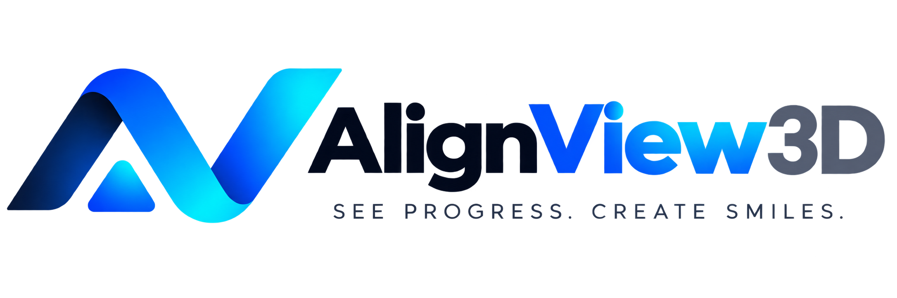

<div align="center">

  

  <br />
  <br />

  <a href="https://alignview-3d.vercel.app">
    
  </a>

  <p align="center">
    <b>A medical-grade WebGL 2.0 dental STL previewer and continuous multi-stage orthodontic aligner simulation platform.</b>
  </p>

  <p align="center">
    <a href="https://alignview-3d.vercel.app">
      
    </a>
    <a href="https://alignview-3d.vercel.app/login">
      
    </a>
  </p>

  <p align="center">
    
    
    
    
    
    
    
    
  </p>

  <p align="center">
    <sub>A proprietary software product of <b>MidCell Studios</b>. All Rights Reserved.</sub>
  </p>

</div>

---

> [!IMPORTANT]
> **AlignView 3D** is engineered for dental clinicians, orthodontists, CAD labs, and medical software developers. It operates **100% client-side** in your web browser with zero remote file uploads, ensuring total HIPAA and GDPR privacy compliance.

---

## 🌟 Visual Feature Showcase

<table width="100%">
  <tr>
    <td width="50%" valign="top">
      <h3>🦷 1. Dual-Tissue Anatomy & Occlusion</h3>
      <ul>
        <li><b>Pearlescent Enamel</b>: Physically-based rendering (PBR) with natural specular highlights and studio reflections.</li>
        <li><b>Anatomical Gingiva</b>: Subsurface coral-pink gum tissue geometry.</li>
        <li><b>Dynamic Arch Views</b>: Instant toggle between <b>Both Arches</b> (Class I occlusion), <b>Upper Only</b>, <b>Lower Only</b>, and <b>Split View</b>.</li>
      </ul>
    </td>
    <td width="50%" valign="top">
      <h3>🎬 2. Continuous Multi-Stage Simulation</h3>
      <ul>
        <li><b>Biomechanical Trajectory</b>: Continuous rotational torque, tipping corrections, and parabolic arch expansion across unlimited stages (<code>1 ... N</code>).</li>
        <li><b>Smooth Scrubber</b>: Scrub stages at 60 FPS with discrete ticks and active gradient progress fill.</li>
        <li><b>Playback Controls</b>: Step Back (<code>|◀</code>), Play/Pause (<code>▶</code>/<code>⏸</code>), Step Forward (<code>▶|</code>), variable speed (<code>0.5x</code> to <code>2.5x</code>), and loop mode.</li>
      </ul>
    </td>
  </tr>
  <tr>
    <td width="50%" valign="top">
      <h3>📐 3. Laser Caliper & Cross-Section Slicing</h3>
      <ul>
        <li><b>Point-to-Point Caliper</b>: Click any 2 landmarks on teeth or gingiva to calculate live Euclidean distance in millimeters (<code>0.01 mm</code> precision).</li>
        <li><b>3-Axis Slicing Engine</b>: Slice through dental arches along <b>X</b>, <b>Y</b>, or <b>Z</b> planes (<code>-30mm</code> to <code>+30mm</code>) for internal crown and root inspection.</li>
      </ul>
    </td>
    <td width="50%" valign="top">
      <h3>🎨 4. 4 Diagnostic Material Shaders</h3>
      <ul>
        <li><b>Shaded (PBR)</b>: Photorealistic studio dental material with contact shadows.</li>
        <li><b>Wireframe</b>: High-density triangle and polygon mesh inspection.</li>
        <li><b>Solid Clay</b>: Matte studio clay for topological curvature defect analysis.</li>
        <li><b>X-Ray Glass</b>: Semi-transparent holographic glass shader for internal inspection.</li>
      </ul>
    </td>
  </tr>
</table>

---

## 🧭 Interactive Navigation & Controls

| Action | Desktop (Mouse) | Mobile / Tablet (Touch Gestures) | Description |
| :--- | :--- | :--- | :--- |
| **Orbit / Rotate** | `Left Click + Drag` | `Single-Finger Drag` | 360° smooth camera orbit around center of arch |
| **Pan Viewport** | `Right Click + Drag` | `Two-Finger Drag` | Pan camera horizontally and vertically |
| **Zoom Viewport** | `Mouse Wheel Scroll` | `Pinch In / Out` | Bounded zoom range with smooth damping |
| **Snap Camera** | Click `U` / `D` / `L` / `R` / `F` | Tap `U` / `D` / `L` / `R` / `F` | Smoothly tween camera to Top, Bottom, Left, Right, Front |
| **Measure Caliper** | Select `Measure` & Click 2 Points | Select `Measure` & Tap 2 Points | Places 3D markers with live millimeter distance |
| **Cross-Section** | Select `Section` & Drag Slider | Select `Section` & Drag Slider | Dynamically slices model along chosen X/Y/Z axis |
| **Stage Scrubbing** | Drag Timeline Slider | Drag Timeline Slider | Step through treatment trajectory stages ($1 \dots N$) |

---

## 🏗️ Architecture & Engine Data Flow

```mermaid
graph TD
    %% Global Application Architecture
    subgraph UI_Layer ["🖥️ Presentation & Routing Layer (Next.js 16 App Router)"]
        LandingPage["src/app/page.tsx (Landing Page with Typewriter & Scroll Reveal)"]
        StudioPage["src/app/studio/page.tsx (3D STL Dental CAD Studio)"]
        LoginPage["src/app/login/page.tsx (Clinician Portal & Fast-Track Demo)"]
        Header["Header (Brand Lockup, Logout, Reset, Screenshot, Fullscreen)"]
        LeftSidebar["Upper Arch Sidebar (Search, File List, 3D Thumbs)"]
        RightSidebar["Lower Arch Sidebar (Search, File List, 3D Thumbs)"]
        Timeline["TimelinePlayback (Multi-Stage Scrubber, Speed, Loop)"]
        UploadModal["UploadModal (Drag-and-Drop STL Parser)"]
    end

    subgraph State_Layer ["⚡ Reactive State Store (Zustand 4.5)"]
        Store[("useViewerStore")]
        Store --- S1["Model Files & Active Selection (Upper / Lower)"]
        Store --- S2["View Modes (Both / Upper / Lower / Split)"]
        Store --- S3["Render Shaders (Shaded / Wire / Solid / X-Ray)"]
        Store --- S4["Active Tools (Move / Rotate / Zoom / Pan / Measure / Section)"]
        Store --- S5["Timeline Playback (Stage 1..N, Speed, Loop)"]
        Store --- S6["Camera Controls (Snap Targets & Tweens)"]
        Store --- S7["Telemetry Data (Vertices, Triangles, Dimensions)"]
    end

    subgraph Viewport_Layer ["🌐 3D Viewport & Overlays (React Three Fiber)"]
        Canvas["DentalCanvas (R3F Canvas, Studio Softbox Lights, Contact Shadows)"]
        ViewCube["ViewCubeGizmo (U / D / L / R / F Snap Controls)"]
        ToolPalette["FloatingToolPalette (Tool Switcher)"]
        StatsCard["ModelStatsCard (Live Geometry Telemetry)"]
        RenderPill["RenderModePill (Shader Selector)"]
        ViewPill["ViewModePill (Arch View Selector)"]
        MeasureOverlay["MeasurementOverlay (Real-time Caliper Distance)"]
        SectionSlider["SectionSlider (Dynamic X/Y/Z Slice Offset)"]
    end

    subgraph Core_3D_Engine ["⚙️ 3D Geometry & Simulation Pipeline (Three.js)"]
        ModelRenderer["DentalArchModel (Dual-Arch Mesh Renderer)"]
        GeomGen["DentalGeometryGenerator (Tooth Morphology & Aligner Morpher)"]
        STLLoader["STLLoader (Custom Binary/ASCII Mesh Parser)"]
        Shaders["Dental Shaders (Pearlescent Enamel PBR & Coral Gingiva)"]
        ClipEngine["Local Clipping Plane Engine (Cross-Section Inspection)"]
        CaliperRaycast["Point-to-Point Raycaster (3D Distance Measurement)"]
    end

    %% Component Data Flows
    LandingPage & StudioPage & LoginPage --> Header
    StudioPage --> LeftSidebar & RightSidebar & Timeline & UploadModal & Canvas
    Canvas --> ViewCube & ToolPalette & StatsCard & RenderPill & ViewPill & MeasureOverlay & SectionSlider & ModelRenderer
    ModelRenderer --> GeomGen & STLLoader & Shaders & ClipEngine & CaliperRaycast

    %% Reactive State Bindings
    LeftSidebar & RightSidebar & Timeline & Header & ViewCube & ToolPalette & SectionSlider <--> Store
    Store <--> ModelRenderer
```



---

## 📂 Project Directory Structure

```
AlignView 3D/
├── public/                          # Brand logos, favicons, manifests & STL models
│   ├── favicon.png                  # Site favicon and app icon
│   ├── main-logo.png                # Full brand lockup (Dark text for light backgrounds)
│   ├── main-logo-light.png          # Full brand lockup (Light text for dark backgrounds)
│   ├── logo.png                     # Standalone brand emblem
│   ├── text and tagline.png         # Brand typography and tagline asset
│   └── models/                      # Upper and lower dental arch STL assets
├── src/
│   ├── app/
│   │   ├── globals.css              # Glassmorphism, range sliders, font feature settings
│   │   ├── layout.tsx               # Root layout, Google Fonts (Outfit, Plus Jakarta Sans, JetBrains Mono)
│   │   ├── page.tsx                 # Main landing page
│   │   ├── studio/                  # 3D Dental CAD Studio
│   │   │   └── page.tsx
│   │   ├── login/                   # Clinician Sign-In portal & Fast-Track Demo
│   │   │   └── page.tsx
│   │   ├── terms/                   # Terms of Service & Proprietary Licensing
│   │   │   └── page.tsx
│   │   ├── privacy/                 # Privacy Policy & HIPAA compliance statements
│   │   │   └── page.tsx
│   │   ├── security/                # Security Sandbox specifications
│   │   │   └── page.tsx
│   │   ├── manifest.ts              # Progressive Web App manifest
│   │   ├── robots.ts                # Search crawler instructions
│   │   └── sitemap.ts               # Dynamic XML sitemap
│   ├── components/
│   │   ├── header/
│   │   │   └── Header.tsx           # Studio header, Reset, Screenshot, Logout
│   │   ├── sidebar/
│   │   │   └── ArchSidebar.tsx      # Upper/Lower arch sequence browser & 3D thumbnails
│   │   ├── viewport/
│   │   │   ├── DentalCanvas.tsx     # R3F Canvas, softbox lighting, shadows, camera
│   │   │   ├── DentalArchModel.tsx  # Dual arch mesh, shaders, clipping planes
│   │   │   ├── DentalGeometryGenerator.ts # Tooth morphology & aligner trajectory math
│   │   │   ├── ViewCubeGizmo.tsx    # U/D/L/R/F 3D orientation widget
│   │   │   ├── FloatingToolPalette.tsx # Move, Rotate, Zoom, Pan, Measure, Section
│   │   │   ├── ViewModePill.tsx     # Both, Upper, Lower, Split View selector
│   │   │   ├── RenderModePill.tsx   # Shaded, Wireframe, Solid, X-Ray selector
│   │   │   ├── ModelStatsCard.tsx   # Live vertices, triangles, dimensions telemetry
│   │   │   ├── MeasurementOverlay.tsx # Live millimeter caliper banner
│   │   │   └── SectionSlider.tsx    # Dynamic X/Y/Z clipping plane slider
│   │   ├── timeline/
│   │   │   └── TimelinePlayback.tsx # Multi-stage sequence scrubber & player controls
│   │   ├── landing/
│   │   │   ├── LandingNavbar.tsx    # Floating island navbar
│   │   │   ├── HeroSection.tsx      # Dynamic typewriter hero typing animation
│   │   │   ├── BentoGridSection.tsx # Interactive feature showcase bento grid
│   │   │   ├── MetricsSection.tsx   # GPU performance & telemetry cards
│   │   │   ├── FaqSection.tsx       # Searchable accordion knowledge base
│   │   │   ├── CtaSection.tsx       # Instant launch call to action
│   │   │   └── LandingFooter.tsx    # Dark footer with brand navigation
│   │   ├── ui/
│   │   │   ├── AppPreloader.tsx     # Full-screen orbital brand loading screen
│   │   │   ├── FloatingBackToTop.tsx # Floating tooth back-to-top button
│   │   │   └── ScrollReveal.tsx     # Native IntersectionObserver scroll reveal engine
│   │   └── modals/
│   │       └── UploadModal.tsx      # STL file drag-and-drop parser
│   ├── store/
│   │   └── useViewerStore.ts        # Central Zustand application state store
│   └── types/
│       └── dental.ts                # TypeScript interfaces & types
├── .npmrc                           # Vercel legacy peer dependencies config
├── package.json
├── tsconfig.json
├── tailwind.config.ts
├── LICENSE                          # Proprietary source code license
└── README.md
```

---

## 🚀 Getting Started

### Prerequisites
- **Node.js**: `v18.17.0` or later
- **npm**: `v9.0.0` or later

### Installation & Local Development

1. **Install dependencies**:
   ```bash
   npm install
   ```

2. **Start development server**:
   ```bash
   npm run dev
   ```

3. **Open browser**:
   Navigate to [http://localhost:3000](http://localhost:3000).

### Production Build

```bash
npm run build
npm run start
```

---

## 🔒 Security, HIPAA & GDPR Compliance

- **Zero Cloud Geometry Storage**: All 3D STL files are parsed locally in browser RAM using Web Workers and WebGL buffers. No patient geometry or scan data is transmitted to remote servers.
- **Client-Side Sandbox**: Sessions operate entirely in isolated browser context with zero persistence of sensitive health data.
- **Encrypted Local State**: Clinician preferences and temporary measurements are maintained strictly within client memory.

---

## 📄 License & Intellectual Property

<div align="center">
  <p><b>PROPRIETARY SOFTWARE LICENSE</b></p>
  <p>© 2025–2026 <b>MidCell Studios</b>. All Rights Reserved.</p>
</div>

AlignView 3D, including its source code, 3D dental algorithms, geometry generation logic, shader pipelines, user interfaces, branding, and assets, is the exclusive intellectual property of **MidCell Studios**.

Unauthorized copying, cloning, modifying, reverse engineering, publishing, sublicensing, or distributing this software in whole or in part is strictly prohibited under our [Proprietary License](LICENSE) and [Terms of Service](https://alignview-3d.vercel.app/terms).
